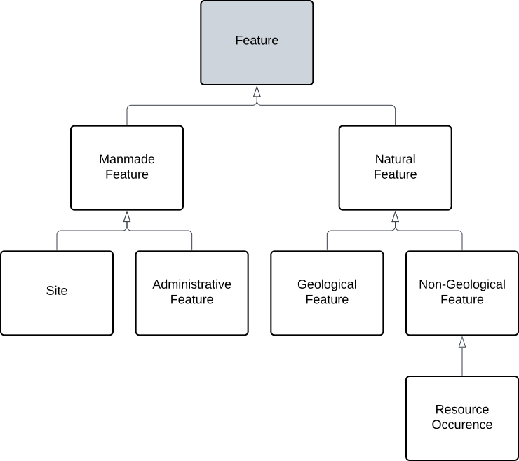

<a href="../../assets/geofh/hierarchy.svg">
<figure id="figure-gfh" markdown style="width:70%">
  
  <figcaption>Figure GFH: The top 3 levels of this model's class hierarchy</figcaption>
</figure>
</a>

## Purpose 

This component model describes the overarching hierarchy of geospatial features classes used by GSWA to describe Mines, Sites, Cratons, Basins etc. 

The purpose of making a single hierarchy it to allow for the orderly integration of data about all types of feature. 

For example, the hierarchy groups the _Tenement Area_ & _Permit Area_ classes under the parent class _Administrative Feature_. This grouping allows querying of these two specialised classes on any properties of the parent as this hierarchy ensures they both have them.

## Model logic

The logic of this component model is shown in the class hierarchy diagram above:

* all features known to GSWA are either 'Man-made', 'Natural' or some specialised form of either 
* visible man-made features are Sites or a specialised form of Site, such as Bore
* Administrative Features are man-mad features that may not be visible on the ground, e.g. a Tenement Area which may exist only in a GIS system
* Resource Occurrences - where economically viable resources are - are natural but not geological features since they have non purely geological logic used to define them

## Hierarchy

The hierarchy of feature types - classes of feature - is:

* Feature
  * Man-made Feature
    * Site
      * Mine
      * Bore
      * ...
    * Administrative Feature
      * Administrative Boundary
        * Tenement Area
        * Permit Area
      * ...
  * Natural Feature
    * Geological Feature
      * Stratigraphic Feature
        * Biostratigraphic Feature
        * Lithostratigraphic Feature
        * Magnetostratigraphic Feature
      * Structural Feature
        * Anticline
        * Fault
        * Graben
        * ...
      * Tectonic Feature
        * Province
        * Craton
        * Orogen
        * ...
    * Non-Geological Feature
      * Resource Occurrence

<a href="../../assets/geofh/mm-hierarchy.svg">
<figure id="figure-gfh" markdown style="width:80%">
  
  <figcaption>Figure MMGFH: Man-made Feature types</figcaption>
</figure>
</a>

<a href="../../assets/geofh/n-hierarchy.svg">
<figure id="figure-gfh" markdown style="width:100%">
  
  <figcaption>Figure NGFH: Natural Feature types</figcaption>
</figure>
</a>