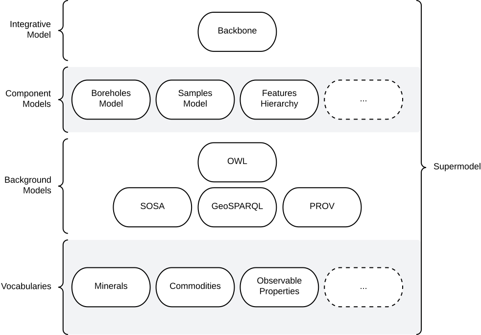

# The Supermodel

<figure markdown>
    
  <figcaption>Figure S1: Informal overview of this Supermodel and its various parts.</figcaption>
</figure>

## Introduction

This "Supermodel" is a multipart model used to coordinate expressions of data from multiple systems within the Geological Survey of WA (GSWA). Specifically, this model allows for:

* integration of data across systems
* multi-system data holding analytics
* system rationalisation planning
* delivery of coordinated/interoperable data

The major parts of this Supermodel are shown in [Figure S1](#the-supermodel) above.

Only a few of the total Vocabularies and Component Models of this Supermodel have so far been defined: see the status in [Overview/Status](index.md#status).

### Related Supermodels

This Supermodel relates to several other Supermodels. The table below gives some details.

| Supermodel                                                                                       | Relationship                                                                                                                                                                                                                                                                                                                                                                                                          |
|--------------------------------------------------------------------------------------------------|-----------------------------------------------------------------------------------------------------------------------------------------------------------------------------------------------------------------------------------------------------------------------------------------------------------------------------------------------------------------------------------------------------------------------|
| [Foundational Spatial Data Framework Supermodel](https://linked.data.gov.au/def/fsdf-supermodel) | The FSDF Supermodel was created by [Geoscience Australia](https://www.ga.gov.au) to integrate multiple foundational spatial datasets within Australia. It specifies both a structure for spatial data and particular fundamental objects to join datasets with, such as authoritative boundaries for Australia and the states.<br /><br />This supermodel adopts the FSDF Supermodel ways of working for spatial data |
| Geological Survey of Queensland's Supermodel                                                     | A Supermodel for a similar agency to GSWA. It implements many of the same Background Models, Vocabularies and some of the same Component Models, such as [Boreholes](components/index#boreholes-profile)                                                                                                                                                                                                              |
| Environmental Information Australia Supermodel                                                   | An emerging Supermodel that includes a series of national environmental datasets across several Federal government agencies. It shares many background models that cover sampling, sites, spatiality, projects etc.                                                                                                                                                                                                   |

## Supermodel Structure

The structure of this Supermodel follows the conventions of the _Supermodel Model_ defined at:

* <https://linked.data.gov.au/def/supermodel>

Each of the main parts of this Supermodel is listed on the left.

Individual data models - called _Component Models_ here - are given within the [Component Models Section](components/index).

## Technical Assets

All parts of this Supermodel, for example individual Component Models or supporting vocabularies, are outlined here in human-readable form (documentation) and their machine-readable forms for such as their schema and data validators are linked to as well. 

Within the formal definition of this Supermodel , all the 'resources' of the Supermodel parts are listed and the roles that each play are given. See the [Supermodel Definition](#supermodel-definition).

## Supermodel Definition

The machine-readable definition of this Supermodel is a Turtle file, online at:

* <https://linked.data.gov.au/def/gswa-supermodel.ttl>

Its content is rendered in human-readable form as follows:

| Resource                                                                    | Role                                                                         | Description                                                                                             |
|-----------------------------------------------------------------------------|------------------------------------------------------------------------------|---------------------------------------------------------------------------------------------------------|
| [Supermodel Definition](https://linked.data.gov.au/def/gswa-supermodel.ttl) | [Profile](https://www.w3.org/TR/dx-prof/#Class:Profile)                      | The formal definition of this Supermodel, including all its parts                                       |
| **Component Models**                                                        |                                                                              |
| [Bore Model](components/bore.md)                                            | [Component Model](https://linked.data.gov.au/def/supermodel/component-model) | A model that describes physical, functional and operational aspects of Bores, sometimes known as Wells. |                                                                   
| **Background Models**                                                       |                                                                              |
| **Vocabularies**                                                            |                                                                              |

## Modelling Documentation

The following subsections apply to all models linked to and within this Supermodel.

### Diagram Conventions

All the models within this Supermodel are visualised with informal OWL diagrams. These are diagrams that represent the Classes, Properties and Axioms of the [Web Ontology Language](background.md#web-ontology-language-owl) with the elements shown in Figure K below.

<figure markdown>
  
  <figcaption>Figure K: OWL Diagram Element Key</figcaption>
</figure>

### Namespaces

Namespaces provide unique identity to elements within this Model - classes, predicates, validation shapes and example data. Prefixes for namespaces are used to assist with documentation readability.

Where you see a prefix used, something like `xxx:`, it is to be replaced with the namespace for complete term definition. For example, using the table below, we can understand that `bore:Bore` is equivalent to `https://linked.data.gov.au/def/borehole/Bore`.

The following prefixed namespaces are used in class and property definition tables and the code examples following:

| **Prefix** | **Namespace**                           | **Description**                                                                                                                |
|------------|-----------------------------------------|--------------------------------------------------------------------------------------------------------------------------------|
| `ex`       | `http://example.com/`                   | Non-resolvable namespace for examples                                                                                          |
| `bore`     | `https://linked.data.gov.au/def/bore/`  | The namespace for the [Bore Model](components/bore.md)                                                                         |
| `dcat`     | `http://www.w3.org/ns/dcat#`            | [Data Catalogue vocabulary](https://www.w3.org/TR/vocab-dcat/): cataloguing international standard                             |
| `dcterms`  | `http://purl.org/dc/terms/`             | [Dublin Core Terms](https://www.dublincore.org/specifications/dublin-core/dcmi-terms/): basic library catalogue-style metadata |
| `geo`      | `http://www.opengis.net/ont/geosparql#` | [GeoSPARQL](https://docs.ogc.org/is/22-047r1/22-047r1.html): Semantic Web spatial data international standard                  |
| `prov`     | `http://www.w3.org/ns/prov#`            | [Provenance Ontology](https://www.w3.org/TR/prov-o/): provenance data structures international standard                        |
| `rdfs`     | `http://www.w3.org/2000/01/rdf-schema#` | [RDF Schema vocabulary](https://www.w3.org/TR/rdf12-schema/): Basic structural RDF elements                                    |
| `schema`   | `https://schema.org/`                   | The general-purpose [schema.org](https://schema.org) model                                                                     | 
| `skos`     | `http://www.w3.org/2004/02/skos/core#`  | [Simple Knowledge Organization System](https://www.w3.org/TR/skos-reference/): a model for controlled vocabularies             |
| `xsd`      | `http://www.w3.org/2001/XMLSchema#`     | [XML Schema Definitions Datatypes](https://www.w3.org/TR/xmlschema11-2/)                                                       |

These namespaces appear at the start of RDF data files in the [Turtle](https://www.w3.org/TR/turtle/) format (see next subsection) and SPARQL query text (the section after the next section) in a form similar to this table, for example in the schema for the [Bore Model](components/bore.md) you can see the prefix `bore`for its namespace on the first line: 

* `PREFIX bore: <https://linked.data.gov.au/def/bore/>`

### RDF code

Many examples for the models within this Supermodel and all machine-readable assets are stored in the [Turtle](https://www.w3.org/TR/turtle/) format. This format is a compact representation of RDF data and is generally considered to be the most human-readable form that raw RDF data can take.

An example:

```turtle
ex:b-01
    a bore:Bore ;
    schema:depth [
        a schema:QuantitativeValue
        schema:value 239 ;
        schema:unitCode unit:M ;
    ] ;
.
```

In the example above (from the [Bore Model](components/bore.md)'s `Quantitative Value` class), we have a dummy ID for an instance of a `Bore` - `ex:b-01` - with its class indicated - `ex:b-01 a bore:Bore` - and its depth given as a nested object, indicated by the _predicate_ `schema:depth`:

```turtle
[
    a schema:QuantitativeValue
    schema:value 239 ;
    schema:unitCode unit:M ;
]
```

The nested depth object above is a _Blank Node_, that is an object whose ID we don't need to know because it's a child object of something else.

All the prefixes in this code such as `ex:` and `schema:` are defined in the [Namespaces](#namespaces) section above and are expanded when this code is read by machine to full values, e.g.

`ex:b-01` &rarr; `<http://example.com/ex:b-01>`

### SPARQL queries

The [SPARQL query language](https://www.w3.org/TR/sparql12-query/) is the standard way to query Knowledge Graph's RDF data. SPARQL queries, which look a lot like SQL queries, specify a pattern that is used to extract part from a larger Knowledge Graph, a "subgraph".

For example, if we have the following data:

```turtle
ex:b-01
    a bore:Bore ;
    schema:location ex:Kimberleys ;
    schema:depth [
        a schema:QuantitativeValue
        schema:value 239 ;
        schema:unitCode unit:M ;
    ] ;
.

ex:b-02
    a bore:Bore ;
    schema:location ex:Plibara ;
    schema:depth [
        a schema:QuantitativeValue
        schema:value 1073 ;
        schema:unitCode unit:M ;
    ] ;
.

ex:b-03
    a bore:Bore ;
    schema:location ex:Plibara ;
    schema:depth [
        a schema:QuantitativeValue
        schema:value 38 ;
        schema:unitCode unit:M ;
    ] ;
.
```

Then the following query may be applied:

```sparql
SELECT ?bh
WHERE {
    ?bh 
        a bore:Bore ;
        schema:location ex:Plibara ;
        schema:depth/schema:value ?depthValue ;
    .
    
    FILTER (?depthValue > 100)
}
```

The above query will extract objects of class Bore - `?bh a bore:Bore` - with location of `ex:Plibara` and depth greater than 100. The result will be the ID of `ex:b-02`.